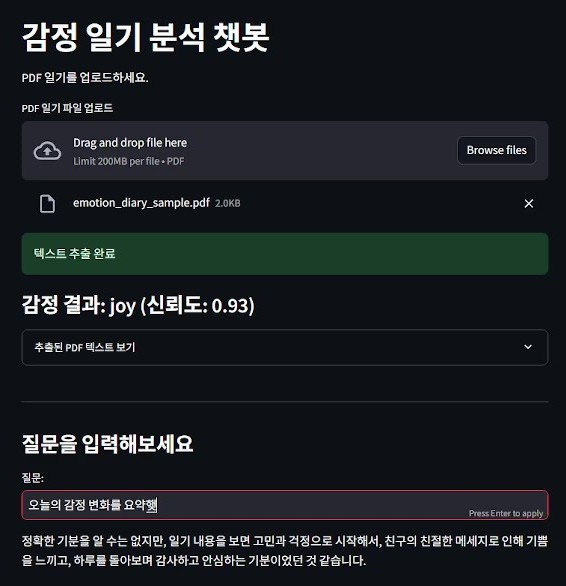

# goemotions

Transformer 기반 감정 분류 모델과 LangChain, FAISS를 활용하여 감정 분석과 RAG 질의응답 기능을 구현한 챗봇

---

## 주요 기능

- PDF 일기 업로드
- PDF 텍스트 자동 추출
- Transformer 기반 감정 분석
- 감정 분류 결과 및 신뢰도 제공
- GoEmotions 데이터셋 활용
- FAISS 벡터 데이터베이스 생성
- LangChain 기반 RAG 질의응답
- Streamlit 웹 인터페이스

---

## 실행 화면

<p align="center">
  
</p>

---

## 동작 과정

1. PDF 일기 업로드
2. PDF 텍스트 추출
3. Transformer 모델을 이용한 감정 분석
4. GoEmotions 데이터와 함께 벡터 임베딩 생성
5. FAISS 벡터스토어 구축
6. 사용자 질문 입력
7. 관련 문서를 검색하여 GPT가 답변 생성

---

## 프로젝트 구조

```text
goemotions-main/
└── app.py
```

---

## 기술 스택

- Python
- Streamlit
- LangChain
- FAISS
- OpenAI API
- Hugging Face Transformers
- GoEmotions Dataset
- PyPDFLoader

---

## 구현 개요

- PDF 일기 내용을 기반으로 감정을 자동 분석
- Hugging Face Transformer 모델 활용
- GoEmotions 데이터셋 활용
- LangChain과 FAISS를 이용한 RAG 질의응답
- Streamlit 기반의 직관적인 웹 인터페이스
